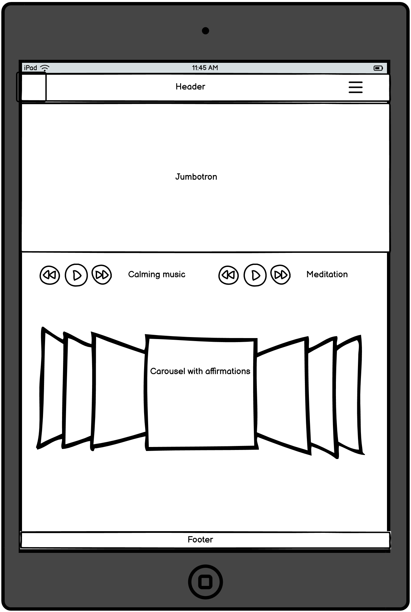

# Mindfulness

## Overview

### Purpose 
Mindfulness is a mindful website aimed at depression and anxiety. Where the use can come and use methods like listening to calming music, meditation or play games to take their minds off their stress to calm down. Gain some information about depression.
The main goal with mindfulness is to help people to cope with their mental health issues by using the art of mindfulness to bring them in to the present moment and reduce the stress that they are going through in this moment.

### Target Audience
My target audience will be someone who is suffering with depression and anxiety, or a loved one who wants to find out some information to be able to help.

## User Stories

### Must-Have User Stories
- **User Story 1:** The user would like to see mindfulness have external links. 
  **Acceptance Criteria:** Mindfulness has included external links to organisations in the information section.
- **User Story 2:** The user would like Mindfulness help ease stress.
  **Acceptance Criteria:** Mindfulness has added Iframes with calming music, guided meditation and and external link to online games which can help to occupy the users mind.
  **User Story 3** The user would like to see information to help recognise symptoms of mental health/stress.
  **Acceptance Criteria** Mindfulness has added an information section which includes psychological, physical and social symptons of depression. 

### Should-Have User Stories
- **User Story 1:** The user would like Mindfulness to have a calming feel.  
  **Acceptance Criteria:** Mindfulness has included a calming colour palete and calming nature images.
- **User Story 2:** The user would like Mindfulness to be well organised
  **Acceptance Criteria:** Mindfulness has links to other sections and is easy to navigate.

### Could-Have User Stories
- **User Story 1:** The user would like Mindfulness to have some positive messages, affirmations. 
  **Acceptance Criteria:** This is a feature that Mindfulness will be looking to add in the future. 
- **User Story 2:** The user would like to see tips on how to deal with mental health.
  **Acceptance Criteria:** This is a feature that mindfulness would like to increase in the future. 

## Design Decisions

### Wireframes

Wireframe - tablet landing page
  

Wireframe - tablet information
  

Wireframe - Desktop information
  

Wireframe - desktop information
  

I had a good look at colour paletes and researched best colours to use for a calming effect on a website. This is why I chose
to use blue and green.

### Accessibility Considerations
I used calming blue and green colours for Mindfulness, because of this I mainly use a font colour of white for the contrast. 
I have included alt text where no text is present i.e on images or on the Iframes. I have also included Aria Label within my code 
to make accessibilty better.

## Features Implementation

### Core Features (Must-Haves)
-In creating this website I stook to HTML and CSS and used flexbox to help with positioning. I did attempt to use Bootstrap 4.6 but I didn't have enough time to master it so decided against using it on this project. 

### Advanced Features (Should-Haves)
-I have included Iframes for music and meditation to help with the calming effect on the webpage. 

## AI Tools Usage

I have not used any AI Tools in the design or coding of this webpage. 

## Testing and Validation

### Testing Results
I have searched Mindfulness on a number of different sized phones and the resposivity was quite good. When I checked it through 
devtools it is slightly off on the bigger screens which will be fixed in the future. The resposivity of the Iframes also needs looking at as I had problems positioning the Iframes where I wanted to place them.

### Validation
Landing page 

Information page 
CSS validation

My landing page and information page only had errors on the sizes of the favicon. When I researched the best sizes to use on google it states the sizes I used are correct. 
The error I had on my CSS was to do with my background colour and using a gradient. 

Light house scoring 

When I looked through my lighthouse score, the reason behind my best practice score was due to external cookies from the Spotify Iframes. This is something I will look in to correcting in the future. 

## Deployment

### Deployment Process
I deployed Mindfulness early in the build to try save any isses later on. I had no issues during deployment. 

## Reflection on Development Process

### Successes
I have not used any AI in the building of Mindfulness. 

### Challenges
I had issues early in the process of building Mindfulness with Bootstrap as I couldn't position the cards where I wanted to put them. For this reason I decided to go down the route of just using flexbox and I found it worked better for this project. I also had some problems resizing images as with this being my first project I wasn't sure on the best sizes to use. 
I have also had some problems lining Iframes and the games section horizontally to each other. This is something I will come back to and try to correct. 
I also found that I was changing elements in error with CSS and it took me awhile to figure out why elements where changing on me. This is something I will definately remember for the future.
I have also had issues with the footer and getting the social media icons to show on the page. 

### Final Thoughts
I have very much enjoyed this project it has given me a big insight on how what not to do whilst coding. 
I will definately spend more time planning with future projects. I need to give elements better classes to stop me from changing elements in error whist styling. 

## Attribution
I have used Stack overflow for help with coding along with W3 Schools and MDN web docs. 
I did look back over previous coding from our walkthrough projects also. 
I have taken images from Pexels website.
Canvas for helping to resize logo. 
Spotify for the Iframes.
Crazy-games for the link to their gaming website. 
Nhs and Mind matters for information and links 
Looking at other readme files for help with syntax. 

## Future Improvements
In the future I would like to fix any isses with responsivity, the icons on the footer. 
The favicon sizes and Iframes to bring lighthouse score up on the best practices and validation. 
I would like to add extra features for example I would like to add a count down timer. This will assist users to box breath and 
help with any anxiety. I would like to include more information about other mental health issues. 
Add some more images and some positive messages and affirmations. 
I would also like to include my own games instead of using external link. 
I would like to incorporate some Bootstrap elements like Carousel and cards.